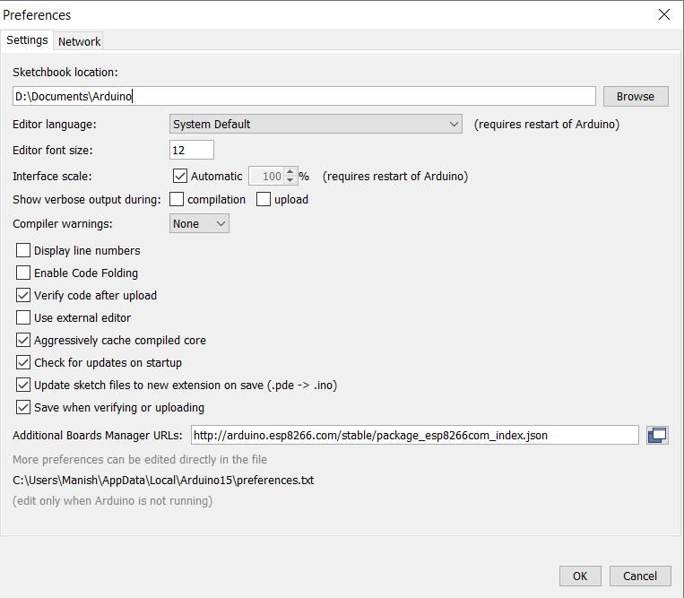

# google_assistant_control_NodeMCU
Voice controlled light on off home automation.
### Edit Preferences using follwing link:
http://arduino.esp8266.com/stable/package_esp8266com_index.json

1. File--> Preferencies --> URL
  Paste the URL link for package download...
  URL:  https://arduino.esp8266.com/stable/package_esp8266com_index.json

2. Board Mannager--> Install the Board(ESP8266 by ESP community)

3. Library Mannager 

4. Install Blynk app in your Android Phone
 
5. Change board and Port -> then upload the code to board
